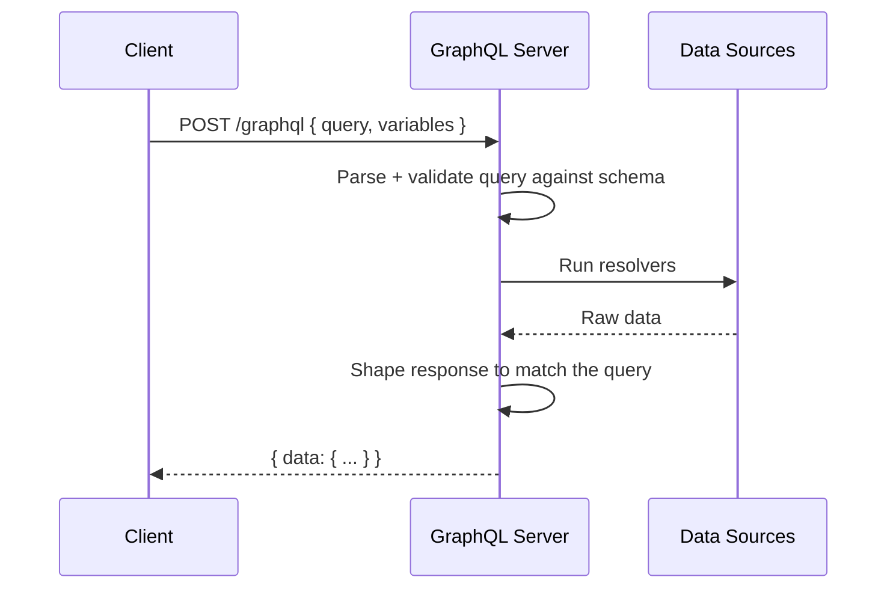
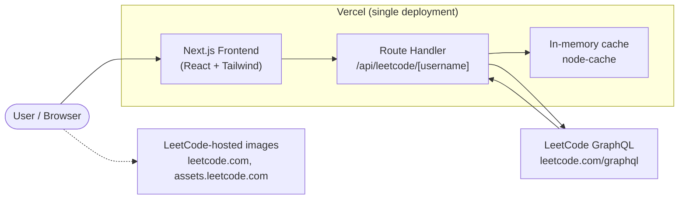
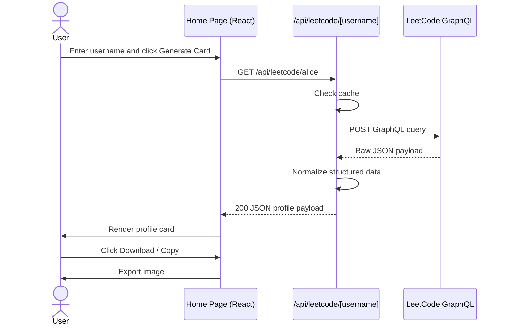
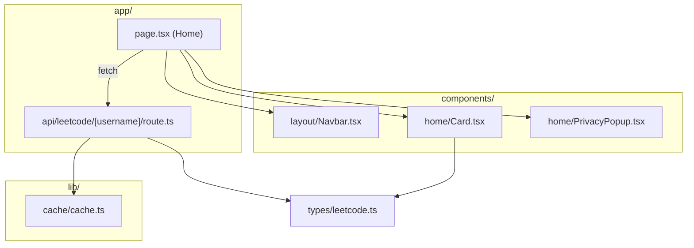
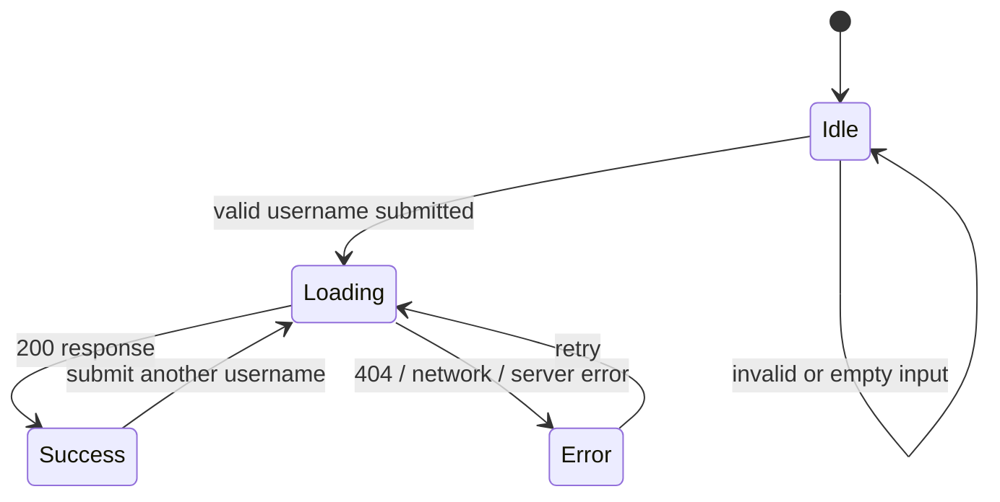

# LeetInsight
---
> A LeetCode profile card generator. Enter a username, get a polished, downloadable card you can share on GitHub, LinkedIn, and your portfolio.

LeetInsight is a single-page Next.js app that reads public LeetCode profile data, renders a clean stats card, and lets users download or copy the card as an image. The frontend and API logic live in the same repository and deploy as one Vercel project.


---

## Demo
| Card Search               | Download Option                | Downloaded Image                           |
|------------------------|------------------------|--------------------------------------------|
|  |  |  |

---

## Table of Contents

1. [Product Overview](#1-product-overview)
2. [Tech Stack](#2-tech-stack)
3. [What is GraphQL?](#3-what-is-graphql)
4. [How LeetInsight Uses LeetCode's GraphQL API](#4-how-leetinsight-uses-leetcodes-graphql-api)
5. [High-Level Design (HLD)](#5-high-level-design-hld)
6. [Low-Level Design (LLD)](#6-low-level-design-lld)
7. [Project Structure](#7-project-structure)
8. [Getting Started](#8-getting-started)
9. [Configuration](#9-configuration)
10. [Deployment](#10-deployment)
11. [Design Decisions & Trade-offs](#11-design-decisions--trade-offs)
12. [Limitations & Future Work](#12-limitations--future-work)
13. [Privacy](#13-privacy)

---

## 1. Product Overview

```text
LeetCode Username
       ↓
Next.js app
       ↓
/api/leetcode/[username]
       ↓
LeetCode GraphQL API
       ↓
Normalize profile fields
       ↓
Render card + export image
```

### Home page layout

```text
Navbar
  ├── LeetInsight brand
  ├── GitHub link
  └── X link

Hero
  ├── "Your LeetCode Stats"
  ├── supporting headline
  └── username input + generate button

Result card
  ├── avatar
  ├── display name / username
  ├── solved totals
  ├── language stats
  ├── badges
  └── PNG download / copy actions
```

### Explicit non-goals

- No authentication or user accounts
- No database or persistent profile storage
- No separate Express or custom backend service
- No social login, saved history, or dashboard

---

## 2. Tech Stack

| Layer            | Technology                                 |
| ---------------- | ------------------------------------------ |
| Framework        | Next.js (App Router)                       |
| Language         | TypeScript                                 |
| UI               | React                                      |
| Styling          | Tailwind CSS                               |
| API client       | Axios                                      |
| Image export     | `html-to-image`                            |
| Caching          | `node-cache`                               |
| Icons            | `lucide-react`, `react-icons`             |
| Hosting          | Vercel                                     |

---

## 3. What is GraphQL?

**GraphQL** is a query language for APIs and a runtime that executes those queries. Instead of a server deciding exactly what every endpoint returns, the client specifies the fields it needs and the server responds with only that shape.

### REST vs. GraphQL

| Aspect          | REST                                         | GraphQL                                         |
| --------------- | -------------------------------------------- | ----------------------------------------------- |
| Endpoints       | Many (`/users/1`, `/users/1/badges`, ...)    | Typically one (`/graphql`)                     |
| Response shape  | Fixed by the server                          | Chosen by the client query                     |
| Over-fetching   | Common                                      | Avoided                                        |
| Under-fetching  | Common                                      | Avoided                                        |
| Typing          | Optional                                     | Built in                                       |

### Core concepts

- **Schema** – a typed contract for the API's objects and fields.
- **Query** – a read request for data.
- **Mutation** – a write request (not used here).
- **Variables** – values passed separately from the query text, such as `$username`.
- **Resolvers** – server-side logic that gathers the requested data.

### How a GraphQL request works



1. The client sends a single HTTP `POST` with a `query` string and optional `variables`.
2. The server validates the query against its schema.
3. The server resolves each requested field.
4. The server returns JSON whose structure matches the query.

### A tiny example

Query:

```graphql
query ($username: String!) {
  matchedUser(username: $username) {
    username
    profile {
      realName
      userAvatar
    }
  }
}
```

Variables:

```json
{ "username": "alice" }
```

Response:

```json
{
  "data": {
    "matchedUser": {
      "username": "alice",
      "profile": {
        "realName": "Alice",
        "userAvatar": "https://..."
      }
    }
  }
}
```

> Note: GraphQL can return HTTP `200` even when the response contains `errors`. The app checks the response body, not just the status code.

---

## 4. How LeetInsight Uses LeetCode's GraphQL API

LeetCode exposes a public GraphQL API at:

```text
POST https://leetcode.com/graphql
```

LeetInsight sends a request from the server using the provided username and asks only for the fields needed to render the profile card: display name, avatar, language solve counts, and badges.

An illustrative query used by the app is:

```graphql
query getUserProfile($username: String!) {
  matchedUser(username: $username) {
    username
    profile {
      realName
      userAvatar
    }
    languageProblemCount {
      languageName
      problemsSolved
    }
    badges {
      id
      name
      icon
      creationDate
    }
  }
}
```

Key points:

- The API call is made server-side in `app/api/leetcode/[username]/route.ts`, not in the browser.
- The username is part of the route path: `/api/leetcode/<username>`.
- The response is normalized before being sent to the UI.
- If `matchedUser` is `null`, the app returns a `404` response and the user sees a validation message in the interface.

---

## 5. High-Level Design (HLD)

### 5.1 Architecture overview

```text
User enters username
      ↓
Next.js page (`app/page.tsx`)
      ↓
GET /api/leetcode/[username]
      ↓
LeetCode GraphQL API
      ↓
Normalize profile response
      ↓
Render card with languages + badges
      ↓
Download / copy image
```

### 5.2 System context



### 5.3 Components at a glance

| Component             | Responsibility                                                      |
| --------------------- | ------------------------------------------------------------------- |
| **Frontend (React)** | Renders the home screen, manages username input, and shows the card |
| **Route Handler**     | Validates the path param, fetches from LeetCode, and returns JSON    |
| **Cache**             | Stores recent profile lookups for a short TTL                       |
| **Card export**       | Converts the rendered card to PNG or clipboard image                |
| **LeetCode GraphQL**  | Source of truth for public user profile data                        |

### 5.4 Primary request flow



### 5.5 Data flow summary

1. The user inputs a LeetCode username.
2. The frontend calls the app's API route using the username in the URL.
3. The route checks the in-memory cache.
4. If needed, it calls LeetCode GraphQL, retrieves profile data, and returns it as JSON.
5. The UI renders the card with solved counts, language stats, and badges.
6. The card is exported to a PNG or copied to the clipboard.

### 5.6 Statelessness

The application is intentionally stateless:

- No database
- No accounts
- No persistent storage of usernames
- No server-side session management

The only temporary storage is the in-memory cache used to reduce repeat LeetCode requests.

### 5.7 Caching strategy

| Layer      | What is cached              | Mechanism                          |
| ---------- | --------------------------- | ---------------------------------- |
| App runtime | Recent profile responses    | `node-cache` with 5-minute TTL     |
| Browser    | UI state only               | React state, no persisted cache    |
| Static assets | JS, CSS, fonts, images    | Vercel static asset delivery      |

The cache is intentionally short-lived to avoid stale stats while still reducing redundant calls.

### 5.8 Non-functional considerations

- **Performance**: one outbound request per user lookup, with a short cache TTL.
- **Reliability**: failures are handled gracefully and surfaced to the user.
- **Security**: no secret keys are needed; the app only reads public LeetCode data.
- **Scalability**: stateless Next.js serverless functions scale well with Vercel.
- **Maintainability**: API-specific logic is kept in a small route and in a few helper types.

---

## 6. Low-Level Design (LLD)

### 6.1 Module map



### 6.2 Responsibilities by file

| File                                        | Responsibility                                                                 |
| ------------------------------------------- | ------------------------------------------------------------------------------ |
| `app/page.tsx`                              | Home screen, username state, loading/error handling, card rendering           |
| `app/api/leetcode/[username]/route.ts`      | Route handler for profile requests and cache logic                             |
| `components/layout/Navbar.tsx`              | Top navigation with brand links                                               |
| `components/home/Card.tsx`                  | Full card rendering plus PNG export / clipboard copy                          |
| `components/home/PrivacyPopup.tsx`          | In-app privacy modal                                                          |
| `lib/cache/cache.ts`                        | Short-lived in-memory cache for profile responses                              |
| `types/leetcode.ts`                         | Shared user/profile schema for the app                                        |
| `next.config.ts`                           | Allows remote LeetCode image hosts for `next/image`                           |

### 6.3 Route contract

The public API route is:

```text
GET /api/leetcode/[username]
```

The handler follows this flow:

1. Read the route param `username`.
2. Check the in-memory cache.
3. If the user is not cached, call the LeetCode GraphQL API.
4. If the user does not exist, return `404`.
5. Cache the result for a short TTL and send it back as JSON.

```ts
// app/api/leetcode/[username]/route.ts
export async function GET(
  request: Request,
  { params }: RouteContext
) {
  const { username } = await params;
  const cached = cache.get(username);

  if (cached) {
    return NextResponse.json(cached);
  }

  const userData = await fetchLeetcodeProfile(username);

  if (!userData) {
    return NextResponse.json({ error: "User not found" }, { status: 404 });
  }

  cache.set(username, userData);
  return NextResponse.json(userData);
}
```

### 6.4 Response contract

| Status | Body | Meaning |
| ------ | ---- | ------- |
| `200` | profile JSON | success |
| `404` | `{ "error": "User not found" }` | user not found on LeetCode |
| `500` | `{ "error": "Something went wrong" }` | unexpected application error |

### 6.5 Frontend state model

The Home page keeps a small local state model:

```ts
const [username, setUsername] = useState("");
const [profile, setProfile] = useState<LeetCodeProfile | null>(null);
const [loading, setLoading] = useState(false);
const [error, setError] = useState("");
```

State transitions are simple:



### 6.6 Data model

The app uses a normalized shape for the card:

```ts
export interface LeetCodeProfile {
  username: string;
  profile: {
    realName: string | null;
    userAvatar: string;
  };
  languageProblemCount: {
    languageName: string;
    problemsSolved: number;
  }[];
  badges: {
    id: string;
    name: string;
    icon: string;
    creationDate: string;
  }[];
}
```

This keeps the UI free from raw LeetCode JSON details and lets the route decide how to shape the payload.

### 6.7 Component contracts

```text
HomePage       props: none
Navbar         props: none
Card           props: { profile: LeetCodeProfile }
PrivacyPopup   props: { isOpen: boolean, onClose: () => void }
```

- `HomePage` controls form submission, state transitions, and profile rendering.
- `Card` renders the final profile card and provides export actions.
- `PrivacyPopup` overlays the privacy policy without leaving the page.

### 6.8 Images and `next/image`

The app loads avatars and badge icons from LeetCode-owned hosts. Those hosts are explicitly allowed in `next.config.ts`:

```ts
images: {
  remotePatterns: [
    { protocol: "https", hostname: "leetcode.com" },
    { protocol: "https", hostname: "assets.leetcode.com" },
  ],
}
```

That prevents `next/image` from failing on remote assets.

### 6.9 Download / export

The card export is performed directly in the browser using `html-to-image`.

- The user can download the card as a PNG.
- The user can also copy the card image to the clipboard.
- The card is rendered using a fixed-width design and then scaled to fit the viewport.

This keeps the flow simple and avoids server-side image generation.

### 6.10 Validation rules

| Where   | Rule                                                           |
| ------- | -------------------------------------------------------------- |
| Client  | Trim whitespace; reject empty input; keep the form simple      |
| Server  | Route param is read from `params`; missing users trigger `404`  |

The server remains the source of truth for user existence. Client validation only improves UX.

---

## 7. Project Structure

```text
leet-insight/
│
├── app/
│   ├── api/
│   │   └── leetcode/
│   │       └── [username]/
│   │           └── route.ts
│   ├── favicon.ico
│   ├── globals.css
│   ├── layout.tsx
│   └── page.tsx
│
├── components/
│   ├── home/
│   │   ├── Card.tsx
│   │   └── PrivacyPopup.tsx
│   └── layout/
│       └── Navbar.tsx
│
├── lib/
│   └── cache/
│       └── cache.ts
│
├── public/
│   ├── LandingPage.png
│   ├── CardSearch.png
│   ├── downloadCard.png
│   └── Downloaded.png
│
├── types/
│   └── leetcode.ts
│
├── .gitignore
├── AGENTS.md
├── CLAUDE.md
├── README.md
├── eslint.config.mjs
├── next.config.ts
├── package-lock.json
├── package.json
├── postcss.config.mjs
├── tsconfig.json
└── node_modules/
```

---

## 8. Getting Started

### Prerequisites

- Node.js (LTS version recommended)
- npm

### Install and run

```bash
git clone https://github.com/AritraC1/LeetInsight.git

cd LeetInsight

npm install

npm run dev
```

Open <http://localhost:3000>.

### Scripts

| Command           | Description                     |
| ----------------- | ------------------------------- |
| `npm run dev`     | Start the local dev server      |
| `npm run build`   | Create a production build       |
| `npm run start`   | Run the production build        |
| `npm run lint`    | Lint the project                |

### Try the API directly

```bash
curl "http://localhost:3000/api/leetcode/your_username"
```

Replace `your_username` with a valid LeetCode handle.

---

## 9. Configuration

No environment variables or secrets are required for the core app flow. The app reads public LeetCode profile data and does not require database credentials, authentication keys, or a backend service.

The key configuration is the remote image allowlist in `next.config.ts` so `next/image` can fetch LeetCode avatars and badges safely.

---

## 10. Deployment

The whole application deploys as a single Vercel project:

```text
GitHub
   ↓
Vercel
   ↓
Next.js app
   ├── frontend UI
   ├── API route
   └── static assets
          ↓
     LeetCode GraphQL
```

1. Push the repository to GitHub.
2. Import the repository into Vercel.
3. Deploy the project.

Vercel automatically detects the Next.js app; no extra server management is required.

---

## 11. Design Decisions & Trade-offs

| Decision                                  | Why                                                                 | Trade-off                                                      |
| ----------------------------------------- | --------------------------------------------------------------------- | -------------------------------------------------------------- |
| Single Next.js app                        | One repo, one deploy, simpler development and maintenance               | Frontend and API logic live together                           |
| Server-side LeetCode fetch               | Avoids browser CORS issues and keeps upstream request logic centralized | Extra server round-trip before UI render                       |
| In-memory cache                          | Reduces repeated username lookups and shortens user wait time          | Cache is ephemeral and not shared across app instances          |
| Browser-side PNG export                  | Easy sharing without backend image generation                         | Export depends on browser support and rendering quality        |
| No database                              | Keeps the app lightweight and privacy-friendly                           | No persistent user history or analytics                        |
| No auth / accounts                       | Keeps the app simple and accessible                                      | No saved data, personalization, or dashboards                  |

---

## 12. Limitations & Future Work

**Limitations**

- LeetCode's GraphQL API is unofficial and can change without notice.
- The app caches results in memory only, so a restart wipes the cache.
- Public profile data may be incomplete for restricted or private profiles.
- Rate limits or upstream outages can trigger temporary failures.

**Possible future work**

- Add contest stats and rating history to the card
- Add support for more badges / richer analytics
- Add server-side rate limiting or a more robust shared cache
- Add a dedicated test suite for API and UI behavior

---

## 13. Privacy

LeetInsight does not require accounts, a database, or persistent profile storage. It reads public LeetCode data for the current request and renders it in the browser. The in-memory cache is short-lived and exists only to reduce duplicated API calls.

---
