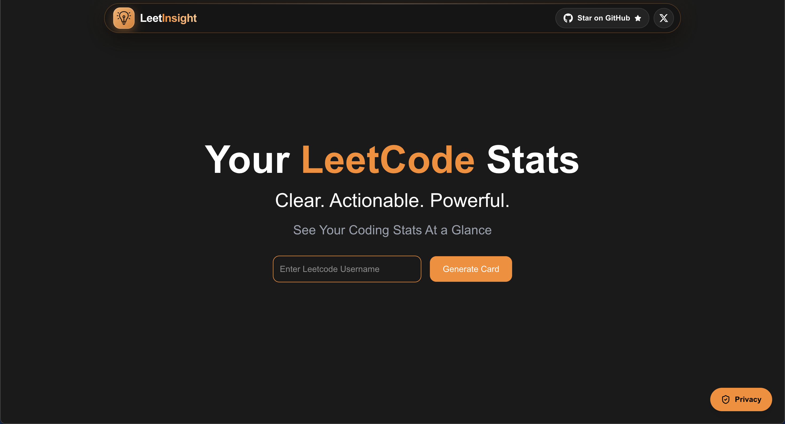
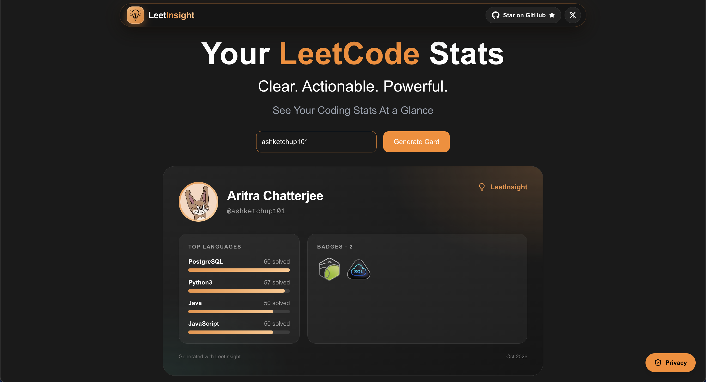
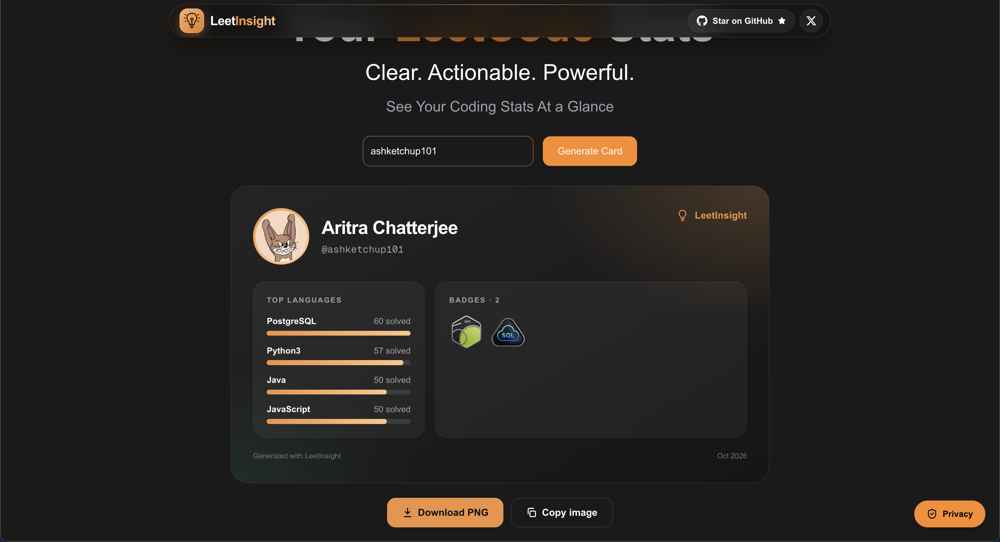
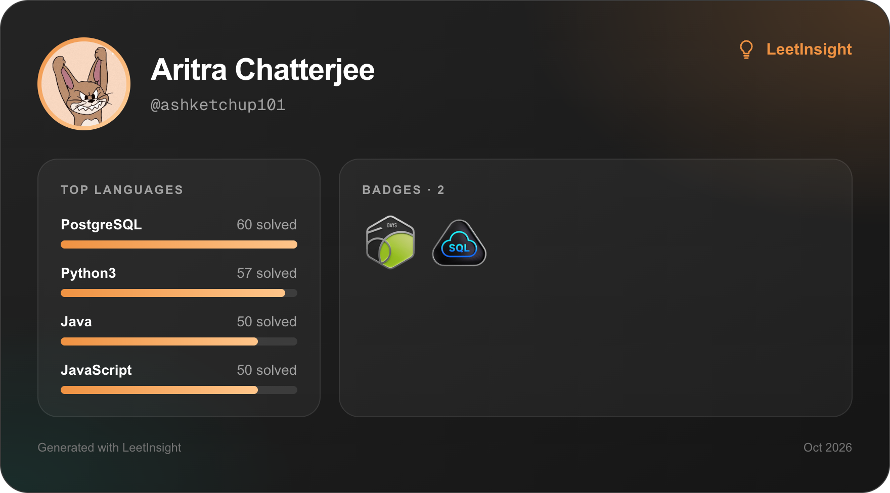
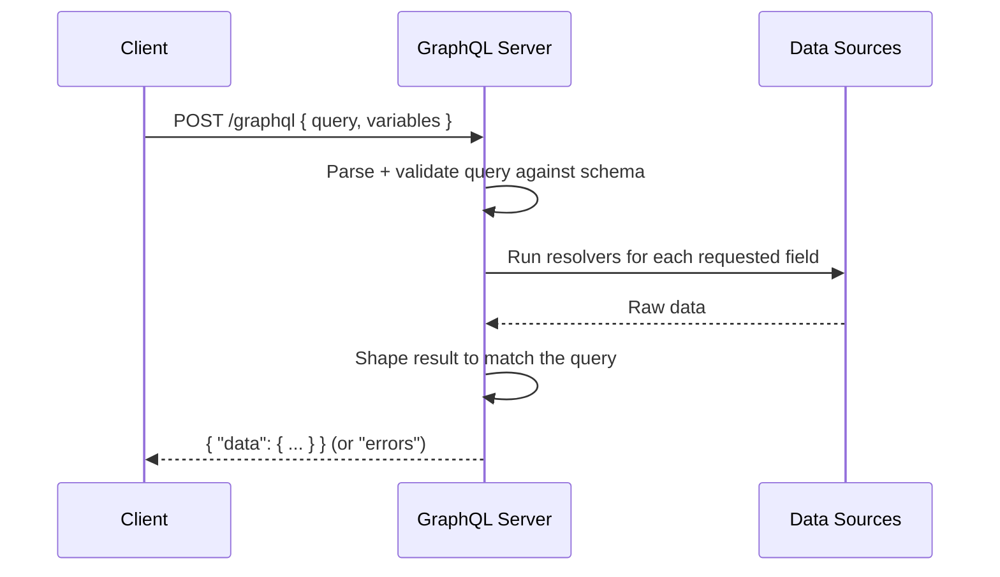
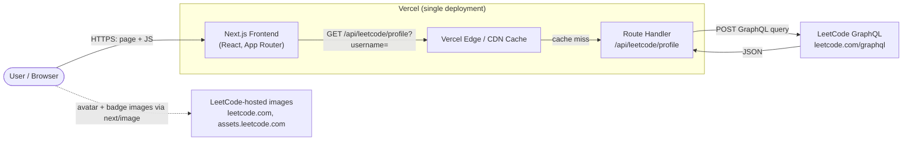
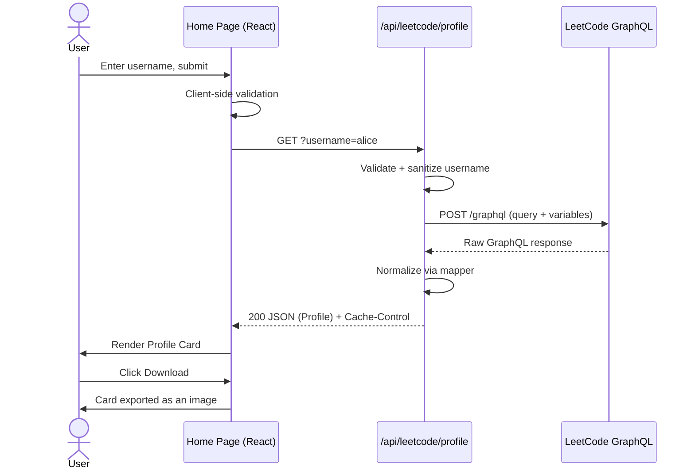
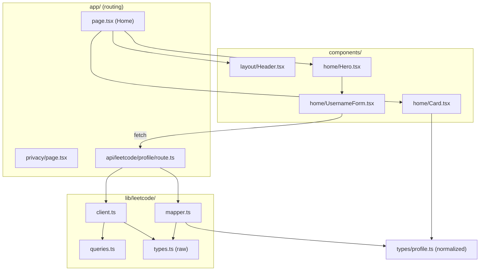
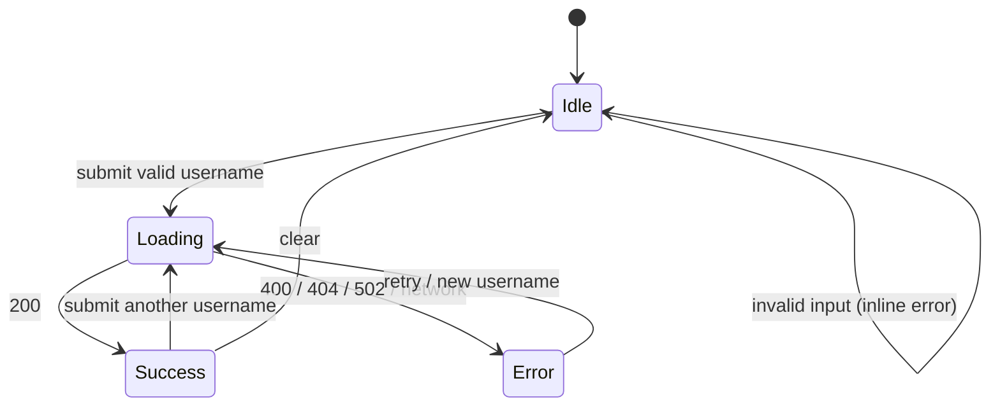

# LeetInsight
---
> A LeetCode profile card generator. Enter a username, get a polished, downloadable card you can share on GitHub, LinkedIn, and your portfolio.

LeetInsight is a rebuild of the original two-repository system (separate UI + Express backend) as **a single Next.js application**. The frontend and backend now live in one codebase and ship as one deployment on Vercel. There is **no database, no authentication, no user accounts, and no persistent profile storage**.



---

## Demo
| Card Search               | Download Option                | Downloaded Image                           |
|------------------------|------------------------|--------------------------------------------|
|  |  |  |


---

## Table of Contents

1. [Product Overview](#1-product-overview)
2. [Tech Stack](#2-tech-stack)
3. [What is GraphQL?](#3-what-is-graphql)
4. [How LeetInsight Uses LeetCode's GraphQL API](#4-how-leetinsight-uses-leetcodes-graphql-api)
5. [High-Level Design (HLD)](#5-high-level-design-hld)
6. [Low-Level Design (LLD)](#6-low-level-design-lld)
7. [Project Structure](#7-project-structure)
8. [Getting Started](#8-getting-started)
9. [Configuration](#9-configuration)
10. [Deployment](#10-deployment)
11. [Design Decisions & Trade-offs](#11-design-decisions--trade-offs)
12. [Limitations & Future Work](#12-limitations--future-work)
13. [Privacy](#13-privacy)

---

## 1. Product Overview

```text
LeetCode Username
       ↓
Next.js
       ↓
LeetCode GraphQL API
       ↓
Fetch profile + statistics
       ↓
Process / normalize data
       ↓
Profile Card
       ↓
Download / share
```

### Pages

Only two pages exist:

| Route      | Purpose        |
| ---------- | -------------- |
| `/`        | Home           |

### Home page layout

```text
Header
  ├── LeetInsight
  ├── GitHub
  └── X

Hero
  ├── "Your LeetCode Stats"
  ├── Description
  └── Username input

Profile Card
  ├── Avatar
  ├── Name / Username
  ├── LeetCode stats
  ├── Languages
  ├── Badges
  └── Download
```

### Explicit non-goals

- No dashboard
- No authentication or user accounts
- No database or persistent profile storage
- No separate Express (or any other) backend server

---

## 2. Tech Stack

| Layer            | Technology                                 |
| ---------------- | ------------------------------------------ |
| Framework        | Next.js (App Router)                       |
| Language         | TypeScript                                 |
| UI               | React                                      |
| Styling          | Tailwind CSS                               |
| Backend          | Next.js Route Handlers                     |
| Upstream data    | LeetCode GraphQL                           |
| Hosting          | Vercel                                     |

---

## 3. What is GraphQL?

**GraphQL** is a query language for APIs, plus a runtime for answering those queries. It was created at Facebook and is now an open specification. Instead of the server deciding what each endpoint returns, **the client describes exactly the data it wants**, and the server returns exactly that shape.

### REST vs. GraphQL

| Aspect          | REST                                         | GraphQL                                         |
| --------------- | -------------------------------------------- | ----------------------------------------------- |
| Endpoints       | Many (`/users/1`, `/users/1/badges`, ...)    | Typically **one** (`/graphql`)                  |
| Response shape  | Fixed by the server                          | Chosen by the client's query                    |
| Over-fetching   | Common (you get fields you don't need)       | Avoided (ask only for what you need)            |
| Under-fetching  | Common (multiple round trips)                | Avoided (nested data in a single request)       |
| Typing          | Optional (OpenAPI)                           | Built in (a strongly typed schema)              |

### Core concepts

- **Schema** – A typed description of all data the API exposes (types, fields, relationships).
- **Query** – A read operation. The client lists the fields it wants.
- **Mutation** – A write operation (not used by LeetInsight).
- **Variables** – Parameters passed separately from the query text, e.g. `$username`.
- **Resolvers** – Server-side functions that fetch the data for each field.

### How a GraphQL request works



1. The client sends a single HTTP `POST` containing a **query string** and optional **variables**.
2. The server **parses and validates** the query against its schema.
3. The server runs **resolvers** for each requested field, pulling data from its sources.
4. The server returns JSON whose shape **mirrors the query**, under a `data` key (and an `errors` key if something failed).

### A tiny example

Query:

```graphql
query ($username: String!) {
  matchedUser(username: $username) {
    username
    profile {
      realName
      ranking
    }
  }
}
```

Variables:

```json
{ "username": "alice" }
```

Response:

```json
{
  "data": {
    "matchedUser": {
      "username": "alice",
      "profile": { "realName": "Alice", "ranking": 12345 }
    }
  }
}
```

Notice that only `username`, `realName`, and `ranking` come back, nothing more.

> **Note:** GraphQL responses often return HTTP `200` even when something went wrong. Always check the `errors` field in the body, not just the status code.

---

## 4. How LeetInsight Uses LeetCode's GraphQL API

LeetCode exposes a public GraphQL endpoint that powers its own website:

```text
POST https://leetcode.com/graphql
```

LeetInsight sends a query with the user's `username` as a variable and asks only for the fields the card needs: profile info, solved-problem counts by difficulty, per-language solve counts, and badges.

An **illustrative** query (verify field names against the live schema, because LeetCode's API is **unofficial/undocumented and can change without notice**):

```graphql
query userProfile($username: String!) {
  allQuestionsCount {
    difficulty
    count
  }
  matchedUser(username: $username) {
    username
    profile {
      realName
      userAvatar
      ranking
      countryName
    }
    submitStats: submitStatsGlobal {
      acSubmissionNum {
        difficulty
        count
      }
    }
    languageProblemCount {
      languageName
      problemsSolved
    }
    badges {
      id
      displayName
      icon
    }
  }
}
```

Key points:

- The call is made **server-side** from a Route Handler, never from the browser. This avoids CORS issues and keeps the upstream details hidden from the client.
- The raw GraphQL response is **never sent to the UI**. It is mapped into LeetInsight's own data model first (see [LLD](#6-low-level-design-lld)).
- If `matchedUser` is `null`, the username does not exist.

---

## 5. High-Level Design (HLD)

### 5.1 Architecture evolution

**Before** (two repositories, two deployables):

```text
LeetInsight UI
      ↓ HTTP
LeetInsight Backend (Express)
      ↓
LeetCode GraphQL
```

**After** (one repository, one deployable):

```text
                 Next.js
              ┌───────────┐
              │           │
           Frontend     Backend
              │           │
              │       API Route
              │           │
              └─────┬─────┘
                    ↓
             LeetCode GraphQL
```

### 5.2 System context



### 5.3 Components at a glance

| Component              | Responsibility                                                                 |
| ---------------------- | ------------------------------------------------------------------------------ |
| **Frontend (React)**   | Renders the Home page, collects the username, displays and exports the card.   |
| **Route Handler**      | Validates input, calls LeetCode, normalizes data, sets cache headers, returns JSON. |
| **`lib/leetcode`**     | Reusable non-UI logic: GraphQL client, query strings, raw types, mapper.       |
| **Vercel Edge/CDN**    | Serves static assets and can cache API responses via `Cache-Control`.          |
| **LeetCode GraphQL**   | The upstream source of truth for profile and statistics.                       |

### 5.4 Primary request flow



### 5.5 Data flow summary

1. **Input**: user types a LeetCode username.
2. **Request**: the browser calls LeetInsight's own API route, not LeetCode directly.
3. **Fetch**: the Route Handler queries LeetCode GraphQL.
4. **Normalize**: the response is converted into a stable internal `Profile` model.
5. **Cache**: the response is cached where appropriate.
6. **Render**: the UI draws the Profile Card.
7. **Export**: the user downloads or shares the card.

### 5.6 Statelessness

The application keeps **no server-side state**. Each request is independent:

- No database → nothing to provision, migrate, or back up.
- No sessions or auth → nothing to leak.
- Horizontal scaling is handled entirely by Vercel's serverless runtime.
- The only "storage" is the HTTP cache, which is disposable.

### 5.7 Caching strategy

| Layer                  | What is cached                    | Mechanism                                          |
| ---------------------- | --------------------------------- | -------------------------------------------------- |
| Vercel Edge / CDN      | API response per username         | `Cache-Control: s-maxage=…, stale-while-revalidate=…` |
| Browser                | API response                      | Standard HTTP cache semantics                      |
| Static assets          | JS, CSS, fonts, images            | Immutable hashed assets served by Vercel           |

Cache **successful** responses only. Never cache `404` for long (a username may be created later) and never cache `5xx`. The cache duration is a trade-off: a longer TTL means fewer upstream calls but staler stats.

### 5.8 Error-handling strategy (HLD)

| Situation                       | API status | UI behavior                              |
| ------------------------------- | ---------- | ---------------------------------------- |
| Missing / malformed username    | `400`      | Inline validation message                |
| Username not found on LeetCode  | `404`      | "User not found" message                 |
| LeetCode rate-limits or errors  | `502`/`503`| "Try again later" message                |
| Unexpected failure              | `500`      | Generic error message                    |

### 5.9 Non-functional considerations

- **Performance**: single round trip to LeetCode; response is trimmed to only what the card needs; CDN caching reduces repeat calls.
- **Reliability**: upstream is unofficial, so failures are expected and handled gracefully.
- **Security**: username is strictly validated; no secrets are required; no user data is stored.
- **Scalability**: stateless serverless functions scale automatically.
- **Maintainability**: all LeetCode-specific knowledge is isolated in `lib/leetcode`, so an upstream change touches one folder.

---

## 6. Low-Level Design (LLD)

### 6.1 Module map



**Dependency rule:** UI components depend only on `types/profile.ts` (the normalized model). They never import anything from `lib/leetcode/types.ts` (the raw LeetCode shape). That boundary is what keeps the UI insulated from upstream changes.

### 6.2 Responsibilities by file

| File                                        | Responsibility                                                                                   |
| ------------------------------------------- | ------------------------------------------------------------------------------------------------ |
| `app/page.tsx`                              | Home page. Composes `Header`, `Hero`, and `Card`. Holds the page-level state (loading, error, profile). |
| `app/privacy/page.tsx`                      | Static privacy policy page.                                                                      |
| `app/api/leetcode/profile/route.ts`         | Route Handler. Validates input, orchestrates client + mapper, sets cache headers, shapes errors. |
| `components/layout/Header.tsx`              | Top bar with the LeetInsight brand, GitHub link, and X link.                                     |
| `components/home/Hero.tsx`                  | Headline ("Your LeetCode Stats"), description, and hosts the form.                               |
| `components/home/UsernameForm.tsx`          | Username input, client-side validation, triggers the API call.                                   |
| `components/home/Card.tsx`                  | Renders the Profile Card (avatar, name, stats, languages, badges) and the Download action.       |
| `lib/leetcode/client.ts`                    | Thin wrapper that POSTs a GraphQL query to LeetCode and returns the raw result.                  |
| `lib/leetcode/queries.ts`                   | GraphQL query strings (single source of truth).                                                  |
| `lib/leetcode/types.ts`                     | TypeScript types describing the **raw** LeetCode response.                                       |
| `lib/leetcode/mapper.ts`                    | Pure function: raw LeetCode response → normalized `Profile`.                                     |
| `types/profile.ts`                          | The **normalized** LeetInsight data model used by the UI.                                        |

### 6.3 Data models

**Raw model** (`lib/leetcode/types.ts`) mirrors LeetCode's response. Illustrative:

```ts
export interface RawLeetCodeResponse {
  data: {
    allQuestionsCount: { difficulty: string; count: number }[];
    matchedUser: {
      username: string;
      profile: {
        realName: string;
        userAvatar: string;
        ranking: number;
        countryName: string | null;
      };
      submitStats: {
        acSubmissionNum: { difficulty: string; count: number }[];
      };
      languageProblemCount: { languageName: string; problemsSolved: number }[];
      badges: { id: string; displayName: string; icon: string }[];
    } | null;
  } | null;
  errors?: { message: string }[];
}
```

**Normalized model** (`types/profile.ts`) is what LeetInsight owns and the UI consumes. Illustrative:

```ts
export interface Profile {
  username: string;
  name: string;
  avatarUrl: string;
  ranking: number | null;
  country: string | null;

  solved: {
    total: number;
    easy: number;
    medium: number;
    hard: number;
  };

  totals: {
    total: number;
    easy: number;
    medium: number;
    hard: number;
  };

  languages: { name: string; solved: number }[];
  badges: { id: string; name: string; iconUrl: string }[];
}
```

> These are starting-point shapes. Adjust the fields to match the final card design and the live LeetCode schema.

### 6.4 Route Handler design

**Endpoint**

```text
GET /api/leetcode/profile?username=<leetcode-username>
```

**Algorithm (`route.ts`)**

```text
1. Read `username` from the query string.
2. If missing or fails validation              → return 400.
3. Call client.fetchProfile(username).
4. If the upstream request fails/times out     → return 502.
5. If `errors` present or `matchedUser` null   → return 404.
6. profile = mapper.toProfile(raw).
7. Return 200 with JSON `profile` and Cache-Control headers.
```

**Skeleton**

```ts
// app/api/leetcode/profile/route.ts
import { NextRequest, NextResponse } from "next/server";
import { fetchLeetCodeProfile } from "@/lib/leetcode/client";
import { toProfile } from "@/lib/leetcode/mapper";

const USERNAME_REGEX = /^[A-Za-z0-9_-]{1,40}$/; // adjust to LeetCode's real rules

export async function GET(request: NextRequest) {
  const username = request.nextUrl.searchParams.get("username")?.trim();

  if (!username || !USERNAME_REGEX.test(username)) {
    return NextResponse.json({ error: "Invalid username" }, { status: 400 });
  }

  try {
    const raw = await fetchLeetCodeProfile(username);

    if (!raw.data?.matchedUser) {
      return NextResponse.json({ error: "User not found" }, { status: 404 });
    }

    const profile = toProfile(raw);

    return NextResponse.json(profile, {
      headers: {
        "Cache-Control": "public, s-maxage=3600, stale-while-revalidate=86400",
      },
    });
  } catch {
    return NextResponse.json(
      { error: "Failed to reach LeetCode" },
      { status: 502 },
    );
  }
}
```

**Response contract**

| Status | Body                                  | Meaning                              |
| ------ | ------------------------------------- | ------------------------------------ |
| `200`  | `Profile` JSON                        | Success                              |
| `400`  | `{ "error": "Invalid username" }`     | Missing or malformed username        |
| `404`  | `{ "error": "User not found" }`       | LeetCode has no such user            |
| `502`  | `{ "error": "Failed to reach LeetCode" }` | Upstream failure or timeout      |

### 6.5 GraphQL client design

`lib/leetcode/client.ts` is deliberately small. It does not need a GraphQL library; a GraphQL call is just an HTTP `POST` with a JSON body.

```ts
// lib/leetcode/client.ts
import { USER_PROFILE_QUERY } from "./queries";
import type { RawLeetCodeResponse } from "./types";

const LEETCODE_GRAPHQL_URL = "https://leetcode.com/graphql";

export async function fetchLeetCodeProfile(
  username: string,
): Promise<RawLeetCodeResponse> {
  const res = await fetch(LEETCODE_GRAPHQL_URL, {
    method: "POST",
    headers: {
      "Content-Type": "application/json",
      Referer: "https://leetcode.com",
    },
    body: JSON.stringify({
      query: USER_PROFILE_QUERY,
      variables: { username },
    }),
    signal: AbortSignal.timeout(8000), // don't hang on a slow upstream
  });

  if (!res.ok) {
    throw new Error(`LeetCode responded with ${res.status}`);
  }

  return res.json();
}
```

Notes:

- The username is passed as a **GraphQL variable**, never string-concatenated into the query. This avoids query injection.
- A timeout prevents slow upstream calls from tying up serverless function time.
- GraphQL can return `200` with an `errors` array, so the Route Handler also checks the body.

### 6.6 Mapper design

`mapper.ts` is a **pure function** with no I/O. This makes it trivially unit-testable.

Responsibilities:

- Pick `All`, `Easy`, `Medium`, `Hard` out of the difficulty arrays and flatten them into `{ total, easy, medium, hard }`.
- Rename fields (`realName` → `name`, `userAvatar` → `avatarUrl`, `problemsSolved` → `solved`).
- Fall back to `username` when `realName` is empty.
- Sort languages by problems solved (descending).
- Resolve **relative badge icon URLs** into absolute `https://leetcode.com/...` URLs, so `next/image` can load them.
- Coerce missing values to safe defaults (`null`, `0`, `[]`) so the UI never has to defend against `undefined`.

```text
RawLeetCodeResponse ──► toProfile() ──► Profile
   (LeetCode's shape)                (LeetInsight's shape)
```

### 6.7 Frontend state machine

The Home page tracks a small state machine:



```ts
type ViewState =
  | { status: "idle" }
  | { status: "loading" }
  | { status: "success"; profile: Profile }
  | { status: "error"; message: string };
```

### 6.8 Component contracts

```text
Header         props: none
Hero           props: { onSubmit(username) , loading }
UsernameForm   props: { onSubmit(username), disabled }
Card           props: { profile: Profile }
```

- `UsernameForm` performs lightweight client-side validation (non-empty, allowed characters) for instant feedback. The server **re-validates**; client-side checks are only a convenience.
- `Card` is purely presentational. It receives a `Profile` and renders it; it performs no fetching.

### 6.9 Images and `next/image`

The avatar and badge icons are hosted by LeetCode. `next/image` only loads remote images from explicitly allowed hosts, so both domains are declared in `next.config.ts`:

```ts
// next.config.ts
import type { NextConfig } from "next";

const nextConfig: NextConfig = {
  images: {
    remotePatterns: [
      { protocol: "https", hostname: "leetcode.com" },
      { protocol: "https", hostname: "assets.leetcode.com" },
    ],
  },
};

export default nextConfig;
```

### 6.10 Download / export

The **Download** button turns the rendered card into an image the user can save and share.

- The export happens **in the browser**; nothing is uploaded or stored.
- A common approach is a DOM-to-image library (for example `html-to-image`) applied to the card element.
- Because the card contains cross-origin images (LeetCode avatar and badges), exporting can hit **canvas CORS/tainting** problems. If that happens, the usual fix is to proxy those images through a same-origin route, or inline them as data URLs before capture. Treat this as an implementation detail to verify early.

### 6.11 Validation rules

| Where   | Rule                                                                 |
| ------- | -------------------------------------------------------------------- |
| Client  | Trim whitespace; reject empty input; reject disallowed characters.   |
| Server  | Trim; enforce a strict allowlist regex and max length; reject others.|

The server is the authority. Never trust client-side validation alone.

### 6.12 Testing approach

| Level         | Target                                              | Notes                                                    |
| ------------- | --------------------------------------------------- | -------------------------------------------------------- |
| Unit          | `mapper.ts`                                         | Feed fixture raw responses, assert the `Profile` output. |
| Unit          | Username validation                                 | Valid / invalid / edge-case inputs.                      |
| Integration   | Route Handler                                       | Mock `fetchLeetCodeProfile`; assert status codes + body. |
| Component     | `UsernameForm`, `Card`                              | Render with props; assert behavior and output.           |

Keep recorded **fixture responses** from LeetCode so tests do not hit the live API.

---

## 7. Project Structure

```text
leet-insight/
│
├── app/
│   ├── page.tsx
│   ├── privacy/
│   │   └── page.tsx
│   └── api/
│       └── leetcode/
│           └── profile/
│               └── route.ts
│
├── components/
│   ├── home/
│   │   ├── Hero.tsx
│   │   ├── UsernameForm.tsx
│   │   └── Card.tsx
│   └── layout/
│       └── Header.tsx
│
├── lib/
│   └── cache/
│       └── cache.ts
│
├── types/
│   └── leetcode.ts
│
└── public/
```

> `lib/` is simply a convention for reusable non-UI logic. It is **not** a special Next.js folder.

---

## 8. Getting Started

### Prerequisites

- Node.js (an LTS version supported by your Next.js version)
- npm, pnpm, or yarn

### Install and run

```bash
git clone https://github.com/<your-username>/leet-insight.git
cd leet-insight

npm install
npm run dev
```

Open <http://localhost:3000>.

### Scripts

| Command           | Description                   |
| ----------------- | ----------------------------- |
| `npm run dev`     | Start the dev server          |
| `npm run build`   | Create a production build     |
| `npm run start`   | Run the production build      |
| `npm run lint`    | Lint the codebase             |

### Try the API directly

```bash
curl "http://localhost:3000/api/leetcode/profile?username=<leetcode-username>"
```

---

## 9. Configuration

No environment variables or secrets are required, since the LeetCode GraphQL endpoint is public and LeetInsight has no database or auth.

The only required configuration is the allowed remote image hosts in `next.config.ts` (see [6.9](#69-images-and-nextimage)).

---

## 10. Deployment

The whole application, frontend and backend, deploys to Vercel as one project:

```text
GitHub
   ↓
Vercel
   ↓
Next.js
   ├── Frontend
   └── Backend/API
          ↓
     LeetCode GraphQL
```

1. Push the repository to GitHub.
2. Import the repository into Vercel.
3. Deploy. Vercel detects Next.js automatically; no extra build config is needed.

Every push to the main branch triggers a production deployment, and pull requests get preview deployments. Route Handlers run as serverless functions, so there is no server to manage.

---

## 11. Design Decisions & Trade-offs

| Decision                                  | Why                                                                 | Trade-off                                                        |
| ----------------------------------------- | ------------------------------------------------------------------- | ---------------------------------------------------------------- |
| Merge UI + backend into one Next.js app   | One repo, one deploy, simpler ops, shared types.                    | Backend and frontend scale/deploy together.                      |
| Route Handlers instead of Express         | No separate server; first-class serverless support on Vercel.       | Tied to the Next.js/Vercel runtime model.                        |
| Call LeetCode from the server, not the browser | Avoids CORS; hides upstream details; enables caching.          | Server makes the outbound requests (counts toward function usage). |
| Normalize data in a mapper                | UI is decoupled from LeetCode's schema; one place to fix changes.   | Extra mapping layer to maintain.                                 |
| No database                               | Nothing to store; privacy-friendly; zero infra.                     | No history, analytics, or user-specific features.                |
| CDN caching via `Cache-Control`           | Fewer upstream calls; faster repeat loads.                          | Stats can be slightly stale within the TTL.                      |

---

## 12. Limitations & Future Work

**Limitations**

- LeetCode's GraphQL API is **unofficial and undocumented**. Fields, behavior, and rate limits can change at any time and may break the app.
- Cached stats can lag behind the real profile by up to the cache TTL.
- Private or restricted profiles may return limited data.

**Possible future work**

- Multiple card themes (light/dark, compact/detailed)
- Contest rating and history on the card
- Embeddable SVG/PNG endpoint for README badges
- Basic rate limiting on the API route

---

## 13. Privacy

LeetInsight does not use accounts, a database, or persistent profile storage. A username is used only to fetch public LeetCode data for the current request. See the in-app privacy policy.

---
